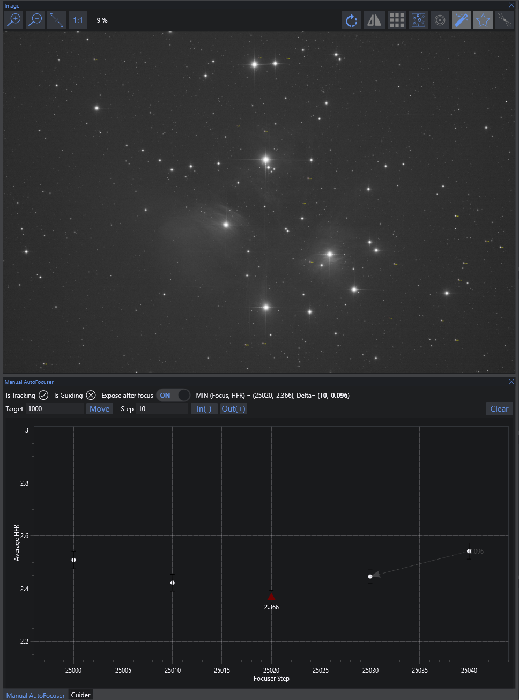
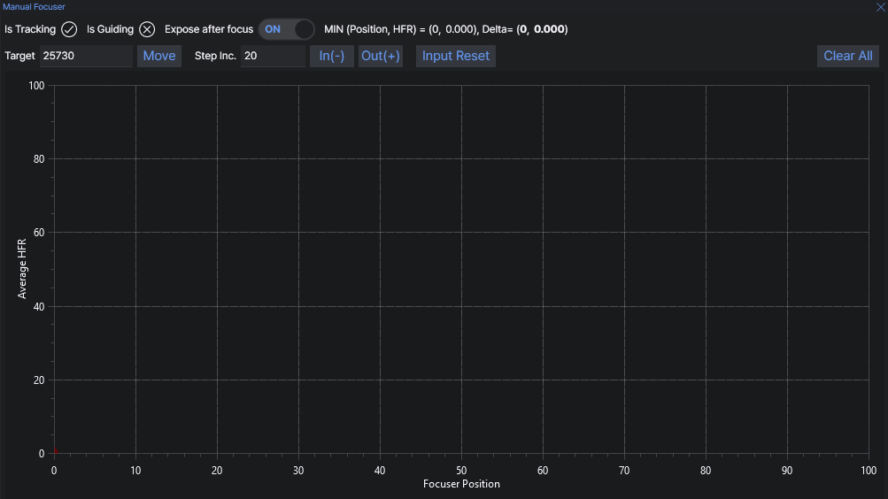

## Interactive Manual Focuser for N.I.N.A.

In N.I.N.A., the default focuser controls in the Imaging tab use the relative step size defined in the Autofocus settings.
This means that when you want to change the focuser movement amount, you have to leave the Imaging tab and go into the Autofocus configuration.

When fine-tuning focus manually — especially when making small, incremental adjustments while checking star shapes — this workflow is inconvenient and slows down the process.

This plugin was created to solve that problem.

Manual Focuser allows you to:
 - Enter focuser increment step values directly in the Imaging tab
 - Move the focuser immediately using those values
 - Automatically captures images after each focus move, computes the average HFR, and plots it on a graph
 - Fine-adjust focus while visually inspecting stars, HRF changes without switching tabs or changing Autofocus settings

The goal is to make manual focus adjustment faster, simpler, and more intuitive during imaging sessions.

## Screenshots
### Tool icon

### Overall View

### Main Dock

