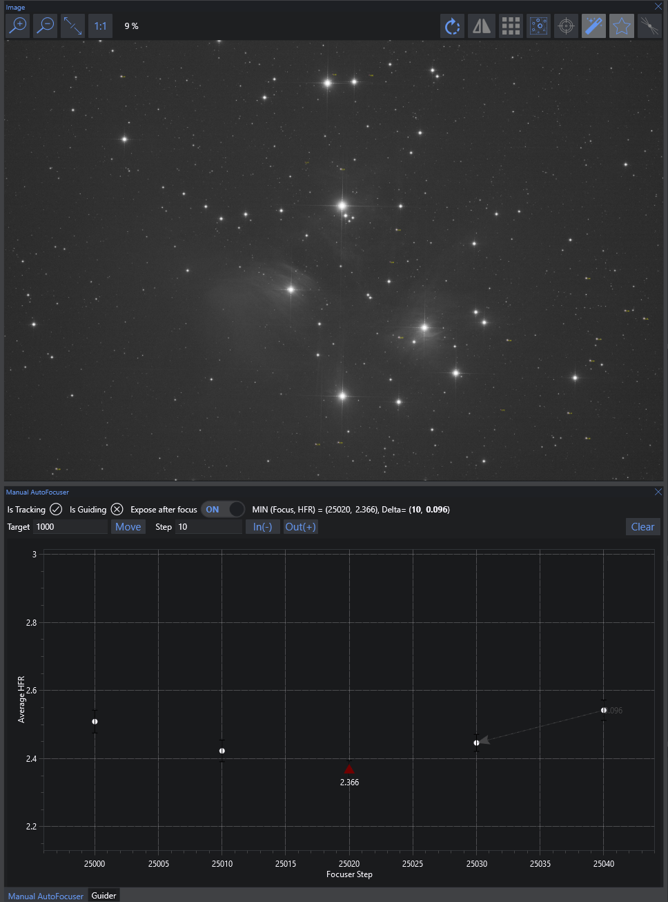
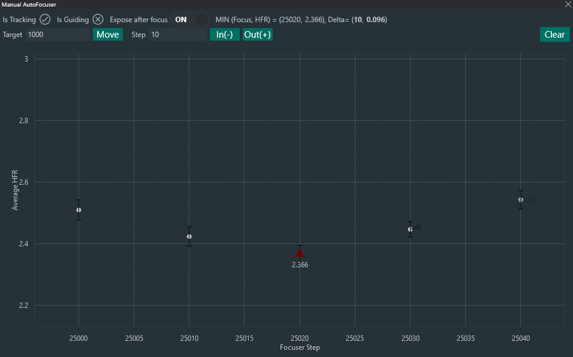

## Interactive Manual Focuser for N.I.N.A.

In N.I.N.A., the default focuser controls in the Imaging tab use the relative step size defined in the Autofocus settings.
This means that when you want to change the focuser movement amount, you have to leave the Imaging tab and go into the Autofocus configuration.

When fine-tuning focus manually — especially when making small, incremental adjustments while checking star shapes — this workflow is inconvenient and slows down the process.

This plugin was created to solve that problem.

Manual Focuser allows you to:
 - Enter focuser increment step values directly in the Imaging tab
 - Move the focuser immediately using those values
 - Automatically captures images after each focus move, computes the average HFR, and plots it on a graph
 - Fine-adjust focus while visually inspecting stars, HRF changes without switching tabs or changing Autofocus settings

The goal is to make manual focus adjustment faster, simpler, and more intuitive during imaging sessions.

# Spike-Based Focus Metric (Variance + Kurtosis)

## Overview

This document describes a spike-based focus metric designed for
reflector telescopes with diffraction spikes (spider vanes).

The metric is designed to:

-   Keep values high while diffraction spikes are still split (bimodal)
-   Drop sharply when the spike merges into a single line
-   Remain continuous and differentiable
-   Be suitable for parabolic curve fitting and autofocus optimization

This version removes auxiliary structural penalties (lambda term) to
keep the formulation minimal and stable.

------------------------------------------------------------------------

# 1. Coordinate System

Given user-provided spike angle θ:

Spike-axis direction:

    s = x cosθ + y sinθ

Perpendicular direction (analysis axis):

    u = -x sinθ + y cosθ

All distribution analysis is performed along the u-axis.

------------------------------------------------------------------------

# 2. Weighting Model

Each pixel intensity I(x,y) contributes with:

    w = I · w_core(r) · w_axis(s)

## Core Suppression

Reduces central saturation influence:

    w_core(r) = 1 - exp( -r² / (2 r0²) )

## Axis Windowing

Focuses on spike region while rejecting center:

    w_axis(s) =
        exp( -s² / (2 σs²) ) ·
        (1 - exp( -s² / (2 σrej²) ))

------------------------------------------------------------------------

# 3. Moment Computation

Total weight:

    W = Σ w_i

Weighted mean:

    μ = (1/W) Σ w_i u_i

Global variance (pixel²):

    σ_g² = (1/W) Σ w_i (u_i - μ)²

Local variance (core-focused, pixel²):

    σ_c² =
        [ Σ w_i exp( -(u_i-μ)² / (2 τ²) ) (u_i-μ)² ]
        /
        [ Σ w_i exp( -(u_i-μ)² / (2 τ²) ) ]

Fourth central moment:

    m4 = (1/W) Σ w_i (u_i - μ)⁴

------------------------------------------------------------------------

# 4. Kurtosis

    κ = m4 / (σ_g²)²

Behavior:

  State             κ value
  ----------------- ---------
  Single spike      Large
  Split (bimodal)   Small

------------------------------------------------------------------------

# 5. Split Penalty (Enhanced)

Base form:

    P_split = 1 / (κ + ε)

Enhanced for sharper drop:

    P_split = ( 1 / (κ + ε) )^p

Recommended:

    p = 2

------------------------------------------------------------------------

# 6. Final Focus Metric (Simplified)

Variance-based version --- no sqrt conversion and no lambda term.

    J =
        β_var · σ_c²
        + β_split · P_split

This minimal formulation improves stability and emphasizes the
split-to-single transition.

------------------------------------------------------------------------

# 7. Units

  Term      Unit
  --------- ------------------------
  σ_c²      pixel²
  σ_g²      pixel²
  κ         dimensionless
  P_split   dimensionless
  J         pixel² + dimensionless

Note: Square-root (pixel conversion) is intentionally NOT applied, as
variance form provides stronger curvature for autofocus fitting.

------------------------------------------------------------------------

# 8. Recommended Initial Parameters

    betaVar = 1.0
    betaSplit = 3.0 ~ 6.0
    splitPower (p) = 2.0
    kurtosisEps = 1e-6

Window parameters:

    coreRejectSigmaPx = 4 ~ 8
    axisRejectSigmaPx = 6 ~ 12
    axisSigmaPx = 20 ~ 40
    coreSigmaPx (τ) = 1.0 ~ 2.0

------------------------------------------------------------------------

# 9. Expected Behavior

  Condition        σ²           κ        P_split   J
  ---------------- ------------ -------- --------- ------------
  Heavy defocus    High         Medium   Medium    High
  Split persists   Decreasing   Low      High      Still High
  Spike merges     Low          High     Low       Sharp Drop

------------------------------------------------------------------------

# 10. Key Properties

-   Fully continuous and differentiable
-   Split-sensitive
-   Suitable for parabolic curve fitting
-   Independent from HFR
-   Minimal parameter design for stability

------------------------------------------------------------------------

End of Document

## Screenshots
### Tool icon

### Overall View

### Main Dock

