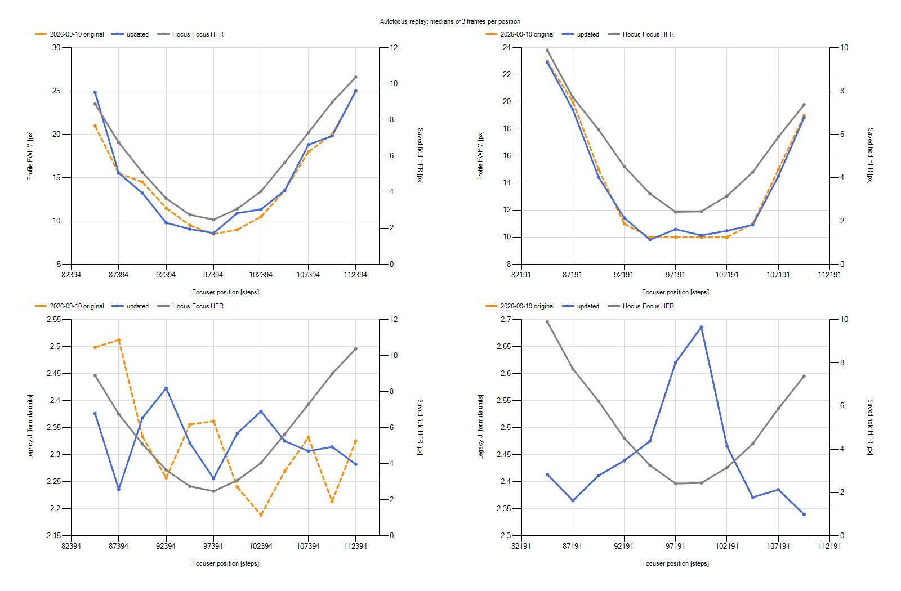

## Interactive Manual Focuser for N.I.N.A.

In N.I.N.A., the default focuser controls in the Imaging tab use the relative step size defined in the Autofocus settings.
This means that when you want to change the focuser movement amount, you have to leave the Imaging tab and go into the Autofocus configuration.

When fine-tuning focus manually — especially when making small, incremental adjustments while checking star shapes — this workflow is inconvenient and slows down the process.

This plugin was created to solve that problem.

Manual Focuser allows you to:
 - Enter focuser increment step values directly in the Imaging tab
 - Move the focuser immediately using those values
 - Automatically captures images after each focus move, computes the average HFR, and plots it on a graph
 - Fine-adjust focus while visually inspecting stars and HFR changes without switching tabs or changing Autofocus settings

The goal is to make manual focus adjustment faster, simpler, and more intuitive during imaging sessions.

# Spike-Based Focus Metric (Variance + Kurtosis)

## Overview

This document describes a spike-based focus metric designed for
reflector telescopes with diffraction spikes (spider vanes).

The metric is designed to:

-   Keep values high while diffraction spikes are still split (bimodal)
-   Drop sharply when the spike merges into a single line
-   Remain continuous and differentiable
-   Be suitable for parabolic curve fitting and autofocus optimization

This version removes auxiliary structural penalties (lambda term) to
keep the formulation minimal and stable.

**Status.** Sections 1 – 10 are the original design. Sections 11 – 15 record what
measurement has since shown, including where the design intent and the data
disagree, and describe the profile based formulation that replaced the pixel
moment one. Read section 11.1 first: it says which of the two development
datasets a given number came from, and one of them turned out to have no
diffraction spikes at all.

The central claim — that a spike based metric stays sensitive near focus where
HFR flattens out — is **still unverified**. See section 13.1 for the sweep needed
to settle it.

------------------------------------------------------------------------

# 1. Coordinate System

Given user-provided spike angle θ:

Spike-axis direction:

    s = x cosθ + y sinθ

Perpendicular direction (analysis axis):

    u = -x sinθ + y cosθ

All distribution analysis is performed along the u-axis.

------------------------------------------------------------------------

# 2. Weighting Model

Each pixel intensity I(x,y) contributes with:

    w = I · w_core(r) · w_axis(s)

## Core Suppression

Reduces central saturation influence:

    w_core(r) = 1 - exp( -r² / (2 r0²) )

## Axis Windowing

Focuses on spike region while rejecting center:

    w_axis(s) =
        exp( -s² / (2 σs²) ) ·
        (1 - exp( -s² / (2 σrej²) ))

------------------------------------------------------------------------

# 3. Moment Computation

Total weight:

    W = Σ w_i

Weighted mean:

    μ = (1/W) Σ w_i u_i

Global variance (pixel²):

    σ_g² = (1/W) Σ w_i (u_i - μ)²

Local variance (core-focused, pixel²):

    σ_c² =
        [ Σ w_i exp( -(u_i-μ)² / (2 τ²) ) (u_i-μ)² ]
        /
        [ Σ w_i exp( -(u_i-μ)² / (2 τ²) ) ]

Fourth central moment:

    m4 = (1/W) Σ w_i (u_i - μ)⁴

------------------------------------------------------------------------

# 4. Kurtosis

    κ = m4 / (σ_g²)²

Behavior:

  State             κ value
  ----------------- ---------
  Single spike      Large
  Split (bimodal)   Small

------------------------------------------------------------------------

# 5. Split Penalty (Enhanced)

Base form:

    P_split = 1 / (κ + ε)

Enhanced for sharper drop:

    P_split = ( 1 / (κ + ε) )^p

Recommended:

    p = 2

------------------------------------------------------------------------

# 6. Final Focus Metric (Simplified)

Variance-based version --- no sqrt conversion and no lambda term.

    J =
        β_var · σ_c²
        + β_split · P_split

This minimal formulation improves stability and emphasizes the
split-to-single transition.

------------------------------------------------------------------------

# 7. Units

  Term      Unit
  --------- ------------------------
  σ_c²      pixel²
  σ_g²      pixel²
  κ         dimensionless
  P_split   dimensionless
  J         pixel² + dimensionless

Note: Square-root (pixel conversion) is intentionally NOT applied, as
variance form provides stronger curvature for autofocus fitting.

------------------------------------------------------------------------

# 8. Recommended Initial Parameters

    betaVar = 1.0
    betaSplit = 3.0 ~ 6.0
    splitPower (p) = 2.0
    kurtosisEps = 1e-6

Window parameters:

    coreRejectSigmaPx = 4 ~ 8
    axisRejectSigmaPx = 6 ~ 12
    axisSigmaPx = 20 ~ 40
    coreSigmaPx (τ) = 1.0 ~ 2.0

Note on τ: see section 11.3. Values in this range pin σ_c² at τ², which is
almost certainly not what was intended.

Profile parameters (section 12):

    metricKind = Legacy
    uMaxPx = 40                  must be wide enough to contain the split
    profileBaselineFraction = 0.15
    peakThresholdFraction = 0.35
    splitWeight = 1.0

Keep the ROI comfortably larger than axisSigmaPx, or the axis window is
truncated by the ROI edge and stops doing anything.

------------------------------------------------------------------------

# 9. Expected Behavior (design intent)

  Condition        σ²           κ        P_split   J
  ---------------- ------------ -------- --------- ------------
  Heavy defocus    High         Medium   Medium    High
  Split persists   Decreasing   Low      High      Still High
  Spike merges     Low          High     Low       Sharp Drop

------------------------------------------------------------------------

# 10. Key Properties

-   Fully continuous and differentiable
-   Split-sensitive
-   Suitable for parabolic curve fitting
-   Independent from HFR
-   Minimal parameter design for stability

------------------------------------------------------------------------

# 11. Measured Behaviour

`Tools/SpikeBatch` replays recorded FITS frames through the same metric code the
plugin runs, and can dump the star ROI as a log stretched PNG plus the flux
profile across the spike.

## 11.1 Know which dataset a number came from

Two focus datasets were used while developing this, and only one of them is
valid for a spike based metric.

  Dataset                                  Spikes visible   Usable
  ---------------------------------------- ---------------- --------
  e-130D / ATR2600M, 34 frame sweep        no               no
  FDK200 / QHY600M, 4 frames               yes              partly

The 34 frame sweep has no diffraction spikes at any stretch. At best focus the
star is a bare dot; at full defocus it is a plain donut from the central
obstruction. Anything measured on it describes blob and donut shape, not spike
behaviour. An earlier revision of this document quoted focus-estimate and
angle-detection results from that sweep; they have been removed rather than
corrected, because the quantity they measured was never the intended one.

Checking the ROI dump before trusting a result is not optional:

    dotnet run -c Release -- "<folder>" --dump out/ --roi-scale 3.5

## 11.2 What the spike actually does (FDK200 / QHY600M)

This telescope shows a clean four vane pattern. Across increasing defocus the
profile perpendicular to the spike goes from a single narrow peak, to a wide
one, to clearly bimodal — the two-lines-merging-into-one behaviour this metric
was started from.

  FOCPOS    HFR     sigma   hfw    fwhm   separation   dip depth
  --------- ------- ------- ------ ------ ------------ ----------
  99222     6.75    8.44    5.61   9      0            0.00
  100000    10.11   8.43    5.59   10     0            0.00
  110000    13.83   7.98    6.55   21     12           0.28
  120000    17.18   12.45   10.92  36     22           0.51

The orientation estimator reports 89.9° at strength ×1.97 against a configured
90°, which is the first confirmation on real spike data that angle detection
works.

Caveat: all four frames sit on one side of focus and the closest is still well
defocused at HFR 6.75. Nothing here says anything about behaviour near focus.

## 11.3 σ_c² saturates at τ²

This one is analytic rather than measured. `σ_c²` is a gaussian-weighted second
moment of width τ; when the underlying u-distribution is wider than τ the ratio
converges to exactly τ². With the default `coreSigmaPx = 1.5` the term is
therefore pinned near 2.25 whenever the star is at all spread out, and cannot
behave as "high on heavy defocus" the way section 9 assumes.

------------------------------------------------------------------------

# 12. Profile Based Formulation

The original formulation accumulates weighted moments over ROI pixels. The
current one builds `p(u)` — flux projected onto the axis perpendicular to the
spike, using the same s-window and core suppression — and derives everything
from it. Every quantity is then in pixels, directly interpretable, and all
candidates can be scored from one pass over the data.

  Kind      Definition
  --------- ---------------------------------------------------------
  Legacy    β_var·σ_c² + β_split·(1/κ)^p, unchanged
  Sigma     RMS width of p(u)
  Hfw       flux weighted mean |u − mean|, the 1D analogue of HFR
  Fwhm      full width at half maximum of the envelope
  Split     separation of the outer peaks, zero while single
  Hybrid    Hfw + splitWeight · Separation

Two details the profile needs to be correct at all:

- Bins must be one pixel. With a spike near 0° or 90°, u lands on integers, so
  any bin width that is not a divisor of one pixel leaves every other bin empty.
- The baseline must be estimated from the profile wings and subtracted. Clipping
  negative background residuals to zero leaves a positive pedestal that dominates
  any moment taken over a wide u range.

Legacy remains the default. Nothing is switched over on the evidence available.

------------------------------------------------------------------------

# 13. Acceptance Tests

`--compare` scores every candidate against the same frames, stars and angle, and
`SpikeBatch` reports four numbers rather than leaving the judgement to the eye:

  Name       Question
  ---------- ---------------------------------------------------------
  rho(HFR)   does it move with HFR at all (Spearman, want ≈ +1)
  nearGain   does it still move where HFR has gone flat (want > 1)
  splitOn    fraction of frames where a split was detected
  failFrac   fraction that fail outright rather than guessing

Measured on the four FDK200 frames:

  metric    rho(HFR)   note
  --------- ---------- --------------------------------------------
  fwhm      1.000      9 → 10 → 21 → 36 px, widest dynamic range
  legacy    1.000      2.02 → 2.59, correct direction, tiny range
  split     0.949      0 until the spike splits, then tracks it
  hfw       0.800
  hybrid    0.800
  sigma     0.200      non-monotonic, drop it

## 13.1 Open question

At the time of the February/March evaluation, `nearGain` could not be computed
from those datasets, because none of them cover
the region near focus. That test is the entire justification for the project —
HFR flattens into a quadratic minimum near focus while a split separation should
fall roughly linearly to zero, giving a sharper vertex — and it remains
unverified. Section 15 adds a September through-focus replay but still does not
establish an advantage on visible diffraction spikes.

Settling it needs a through-focus sweep from an instrument that shows spikes:

- both sides of focus, best focus near the middle
- out to roughly twice the minimum HFR at each end
- closely spaced near focus, which is the region under test
- two or three positions revisited, for a repeatability figure
- exposure long enough that the spikes are visible in the ROI dump

Then:

    dotnet run -c Release -- "<folder>" --auto-angle --compare --roi-scale 3.5 --u-max 60

------------------------------------------------------------------------

# 14. Automatic Spike Angle

The orientation is measured on every frame by integrating background subtracted
flux along rays through each tracked star, in both directions, over an annulus
that excludes the core. The direction collecting the most flux is the spike axis.
It is measured whether or not auto mode is enabled, and shown on the Manual
Focuser panel, so a typed value can be checked against reality.

Two properties of the problem shape the implementation:

- The result is only defined modulo 180°, and a four vane spider produces two
  axes 90° apart with similar strength. Without a tie-break the reported angle
  hops between them frame to frame. Candidate peaks within 35° of the running
  estimate win if they reach 75 % of the strongest peak.
- The median is taken across stars within a frame, not across frames. Averaging
  over time was implemented and measured worse: a sweep spans states where the
  orientation is crisp and states where it is not, so a time window mixes good
  estimates with bad ones rather than averaging repeats of one measurement.

The reported strength — peak over mean of the directional profile — is the guard.
Below roughly 1.2 there is no usable spike and the measurement is discarded. On a
dataset with no spikes at all the estimator still returns an angle, driven by
whatever asymmetry the blob happens to have, which is why the strength figure and
the ROI dump both matter before trusting it.

------------------------------------------------------------------------

# 15. September 2026 Autofocus Replay (2026-10-04)

The merged branch targets **N.I.N.A. 3.2.0.9001 or later**. Build without deploying
into the local N.I.N.A. installation with:

```powershell
dotnet build ManualFocuser.csproj -c Release -p:DeployPlugin=false
dotnet run --project Tools/SpikeChecks -c Release
```

## 15.1 Data and limits

Two FDK200/QHY600M autofocus runs under `C:\StellaC\QHY600M\Autofocus` were replayed:

| Run | Attempt frames | Positions | Range | Exposure/filter |
| --- | ---: | ---: | --- | --- |
| `AutoFocus_20260910_210248/attempt01` | 36 | 12 | 84894–112394, step 2500 | 1 s / L |
| `AutoFocus_20260919_220918/attempt01` | 33 | 11 | 84691–109691, step 2500 | 1 s / L |

Each position has three consecutive exposures. Initial and final validation frames
were kept separate from these attempt sweeps. The `--saved-stars` option reads the
sibling Hocus Focus Region00 JSON as plain data and uses its whole-field HFR as
the reference. Spike seeds come from the saved detector list, then track between
frames; these are a subset of the field stars contributing to HFR.

Log-stretched crops of all five selected stars on the initial attempt frames,
and brightest-star crops throughout both sweeps, show donuts and compact stars
without clearly visible diffraction spikes. Consequently these runs test robustness
and focus-curve behavior, **not the claimed near-focus advantage of diffraction
spikes**. Their 2500-step sampling is also coarse for that claim. Automatic angle
estimates remain plausible on these crops and are not evidence that a spike exists.

## 15.2 Changes supported by the replay

- Select the brightest stars **after** rejecting unsuitable shapes/sizes. Previously
  the brightest fifth could consist entirely of tiny artifacts, starving eligible
  stars. The original raw-pixel replay of September 19 produced no valid points;
  the corrected selector produces a complete 33-frame curve.
- Keep signed background residuals through projection. The earlier ROI subtraction
  clipped them despite the profile code expecting signed samples. Clipping in the
  final nonnegative profile can still bias weak-profile moments; this is not a
  complete solution for Sigma/Hfw.
- Interpolate the two half-height crossings for subpixel FWHM, and reject truncated,
  nonfinite or low-SNR profiles. Require a valley at least 10% deep and 3 wing-noise
  units below the outer peaks before reporting a split.
- Report current-frame angle evidence separately from the last angle used as an
  automatic fallback. Failed detections no longer display an old successful angle.
- Preserve each repeated frame's diagnostic files and use the same one-pixel
  profile grid as the metric. Report failure rates over all evaluated frames,
  and add `nearSNRx`, which includes the observed repeated-exposure scatter.

Comparison against the pre-change core at merge commit `218eca5`, with
`--saved-stars --auto-angle --compare --roi-scale 3.5 --u-max 60`:

| Quantity | September 10: original → updated | September 19: original → updated |
| --- | --- | --- |
| FWHM pooled repeat SD, px | 1.6436 → 0.8750 | 0.8528 → 0.6494 |
| FWHM whole-sweep range/repeat SD | 10.0 → 18.8 | 15.2 → 20.2 |
| Updated FWHM nearSNRx / HFR | 0.35 | 0.12 |
| Split-positive evaluated frames | 64% → 25% | 55% → 12% |

September 10 originally selected four stars; the corrected selector selects five.
Holding that run at four stars gives updated FWHM repeat SD **1.5904 px** (only
about 3% below the original). Thus the approximately 47% end-to-end reduction
includes star selection, and must not be attributed solely to interpolation.
September 19 uses five stars in both versions and improves repeat SD by about 24%.
Lower scatter does not guarantee better focus-position accuracy: for example the
September 10 FWHM fitted vertex moves from 97211 to 96806, while Hocus Focus's saved
final estimate is 97191. September 19's updated FWHM vertex is 98461 versus the
saved estimate 98652. A parabola is only reported when its minimum lies inside
the fitted sample range; it is a diagnostic, not a command to move the focuser.



Both updated FWHM nearSNRx values are below 1. **No improvement over HFR near focus
has been established.** Legacy also remains unsuitable as a minimum-finding signal
on these selected stars. Legacy stays the default to avoid silently changing the
experimental measurement; `Fwhm`, `Split`, `Hfw` and `Hybrid` can now be selected
in plugin options for explicit experiments. Changing the metric clears the spike
curve on the next measurement; HFR is preserved. Parameters are held fixed across
the frames averaged at a position. The plugin's profile half-range remains 40 px;
the comparison above explicitly overrides it to 60 px in the offline tool.

The older February 18 dataset remains a positive control: with configured 90°,
updated FWHM increases approximately 9.5, 10.2, 21.1, 37.0 px and resolved split
separations remain 0, 0, 13, 24 px. Those four frames still do not cross best focus.
Twenty-three dependency-free checks cover analytic Gaussian widths, subpixel
response, real double peaks, shallow ripples, invalid profiles, signed background,
seed starvation, stale angle reporting, and saved-result loading. Offline replay
does not exercise N.I.N.A. UI loading or real equipment capture.

Reproduce an attempt replay without writing into the original capture folder:

```powershell
New-Item -ItemType Directory -Force Tools/SpikeBatch/bin/analysis | Out-Null
dotnet run --project Tools/SpikeBatch -c Release -- `
  "C:\StellaC\QHY600M\Autofocus\AutoFocus_20260919_220918\attempt01" `
  --saved-stars --auto-angle --compare --roi-scale 3.5 --u-max 60 `
  --dump Tools/SpikeBatch/bin/analysis/sep19 --dump-stars 5 `
  --out Tools/SpikeBatch/bin/analysis/sep19.csv
```

## 16. HFR fallback and focus-star GOTO

The panel always retains the host HFR measurement. A separate, conservative
display gate checks whether the selected axis contains extended line signal on
both sides of each star, across three radial bands, against parallel background
strips. At least the configured minimum number of stars must pass, along with
the profile SNR check. Every exposure contributing to an averaged focus point
must pass. Otherwise the panel clears the spike curve/minimum, hides its axis
and series, and displays `Spike detection insufficient · using HFR`. The measured
angle is also withheld until the gate passes. Raw diagnostic metrics remain
available, with a new `clearSpikes` CSV column.

This is a heuristic for usable line signal, not proof of an optical diffraction
pattern. Weak, broad or heavily defocused real spikes can be rejected. Replay
with `--roi-scale 3.5 --u-max 60` rejected all 36 September 10 and 33 September 19
autofocus frames; the September replays used `--saved-stars --auto-angle`.
The February 18 visible-spike control, with configured angle 90°, retained 2 of
4 frames. Five new synthetic morphology checks cover a circular star, defocus
ring, bilateral line, one-sided artifact and wrong axis; 28 core checks pass.

The **Focus star** card automatically loads candidates once when the panel is
first displayed. **Refresh** updates the list later. The plugin
uses NINA's installed bright-star catalogue (magnitude ≤ 4), profile latitude,
longitude and elevation, and current UTC through NINA's coordinate transform.
It lists up to 20 candidates ordered by altitude, then magnitude, above the
minimum altitude (default 45°, adjustable 15–85°) and 5° above the profile's
custom horizon. Refresh after changing location, altitude limits or waiting.
These are visibility suggestions; binary companions, crowding, Moon separation,
and whether the camera will saturate are not evaluated in this initial version.

Select a star and press **GOTO selected star**. The mount must be connected and
unparked, the guider disconnected, and capture, focus movement and mount slews
idle. The altitude/horizon check is repeated immediately before moving. NINA's
telescope mediator handles the slew; **Cancel GOTO** cancels its token. The camera
is reserved during movement. On success the old target's focus chart and tracks
are reset. Take a short exposure afterward to check saturation and actual spike
detection. This version does not automatically expose, plate-solve, return to
the original target, or operate a mask.

Run `dotnet run --project Tools/FocusChecks -c Release` on Windows with NINA 3.2
installed and its catalogue initialized. The harness uses the installed native
astronomy libraries, with no migration scripts, to verify location/time
validation, horizontal coordinates, horizon clearance and catalogue readability.
All 11 checks pass. It sends no equipment commands; real GOTO and NINA UI behavior
still require simulator/in-application verification.

Bahtinov analysis remains a follow-up stage. NINA already provides a manual
[Bahtinov Analyzer](https://nighttime-imaging.eu/docs/master/site/tabs/imaging/).
Its three-line alignment error must be handled separately from ordinary spider
spike width, and validated on masked focus sweeps before controlling a focuser.

The panel groups star selection and manual movement into separate cards, with
wrapping controls for narrow docks and buttons that use the host theme colors.
With at least 560 pixels available, **Focus** is on the left and **Focus star**
on the right. Narrower docks stack them in the same order.
The star picker is a collapsed dropdown with always-visible **Refresh** and
**GOTO** buttons alongside it. Minimum altitude remains in the card header;
long status text is available as a tooltip. Compact padding, 28-pixel buttons,
and folded autofocus/spike controls leave more space for the chart. Button
hover background and foreground use NINA's `ButtonBackgroundSelectedBrush`
and `ButtonForegroundBrush`, following the profile color schema; normal/pressed
background uses `ButtonBackgroundBrush`.
The collapsed **Autofocus** section contains a method selector (currently only
**Linear scan**), **Run autofocus**, and **Single pass**. **Stop focus** is visible
in the manual controls during movement, including an autofocus run.

Linear refers to scanning at fixed position intervals, not a straight-line fit.
Both coarse and fine passes use a weighted quadratic fit. A short, one-sided
fine pass can look nearly straight. The former straight arrow connected the
last two measurements and was not a fit; it has been removed, with Δ HFR shown
in the summary instead. Legends now identify `Measured · coarse/fine` and
`Quadratic · coarse/fine`. Fits are visual aids: the existing autofocus stopping
rules still use measured extrema/thresholds, not the fitted vertex.

Quadratic fitting now centers and scales focuser positions before solving, then
evaluates curves in those normalized coordinates. This avoids large powers of
absolute focuser positions destabilizing the fit. Essentially linear data have
no reported vertex rather than an infinite value, and fewer than three distinct
positions cannot generate a fit. Three new regressions bring the core/fit checks
to 31. Standalone layout previews were inspected at widths 420 and 650 pixels;
they use example stars and a placeholder chart, not a running NINA screen.

End of Document


## Screenshots
### Tool icon


### Overall View


### Main Dock


